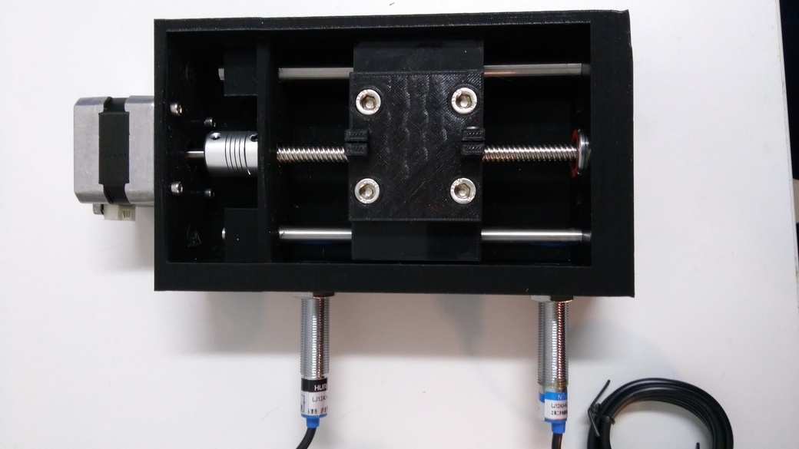

# Mini ECM project

__Note__: This project is work in progress.

This directory contains files that might some day lead to a mostly printable
electrochemical machining system (working with lower currents than most
industrial machines using only off the shelf and 3D printed parts)

## Parts

* An rigid 2 axis (XY) positioning system:
  * The fixed part is done in ([bedxy.jscad](./bedxy.jscad); work in progress)
  * The moveable sled ([xysled.jscad](./xysled.jscad); work in progress)
  * The carriage that connects the moveable sled to the fixed part ([xycarriage.jscad](./xycarriage.jscad); work in progress)

### The Z axis

The z axis assembly consists of a tower that's screwed onto the XY table an provides
linear movement along the third axis. Since there are only low forces this
approach has been used. The tool is mounted on a mounting plated that's attached
via screws onto a sled. The tower is contained in [headtower.jscad](./headtower.jscad).
