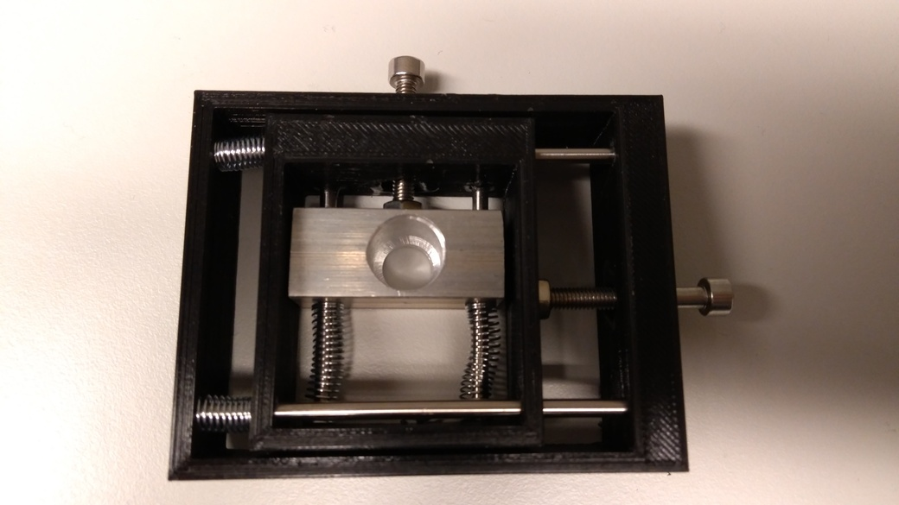

# Physics models

This part of the repository contains models that are used in physics experiments
of are resembling complete experiments

## A hacked screw cross-table

[hackedscrewcrosstable.jscad](./hackedscrewcrosstable.jscad)

Used with aluminium central part as cathode mount for SEM tungsten cathodes
in custom electron beam experiments (Printed out of PLA inside coarse vacuum
chambers). Currently the model is parameterizable but cathod dimensions
are not - and are not checked against boundary conditions.

